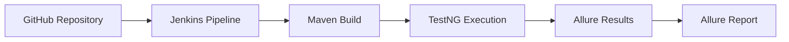

# 🚀 HamoFirstSelenium — Web Automation Testing Framework

<div align="center">

### Selenium-Based End-to-End Automation Framework

Automated testing framework for the **AwesomeQA E-Commerce Application**


</div>

---

# 📌 Project Overview

A comprehensive Selenium-based test automation framework for the **AwesomeQA** e-commerce web application.

🔹 Covers complete user journeys

🔹 Uses Page Object Model (POM)

🔹 Supports Data-Driven Testing

🔹 Includes BDD with Cucumber

🔹 CI/CD enabled via Jenkins

🔹 Rich reporting with Allure

### 🔗 Application Under Test

[https://awesomeqa.com/ui](https://awesomeqa.com/ui)

---

# 🛠 Tech Stack

| Tool               | Version | Purpose                       |
| ------------------ | ------- | ----------------------------- |
| Java               | 21      | Primary language              |
| Selenium WebDriver | 4.29.0  | Browser automation            |
| TestNG             | 7.10.2  | Test framework & execution    |
| Cucumber (BDD)     | 7.20.1  | Behavior-driven scenarios     |
| WebDriverManager   | 5.9.2   | Automatic driver management   |
| Jackson            | 2.18.3  | JSON test data parsing        |
| Allure             | 2.13.9  | Test reporting                |
| Maven              | 3.x     | Build & dependency management |
| Jenkins            | Latest  | CI/CD pipeline                |

---

# 📂 Project Structure

```text
HamoFirstSelenium/
├── src/
│   ├── main/java/org/Pages/
│   │   ├── LoginPage.java
│   │   ├── RegisterPage.java
│   │   ├── AddToCart.java
│   │   ├── WishlistFeature.java
│   │   ├── SearchFeature.java
│   │   └── ContactUsFeature.java
│   │
│   └── test/java/
│       ├── testsPackage/
│       │   ├── LoginTest.java
│       │   ├── RegisterTest.java
│       │   ├── AddtoCartTest.java
│       │   ├── AddtoWishlistTest.java
│       │   ├── SearchFeatureTest.java
│       │   └── ContactUsTest.java
│       │
│       ├── data/
│       │   ├── LoginData.java
│       │   ├── RegisterData.java
│       │   ├── SearchData.java
│       │   └── ContactUsData.java
│       │
│       ├── runners/
│       │   └── LoginCucumberTest.java
│       │
│       ├── stepDefinitions/
│       │   └── LoginSteps.java
│       │
│       └── utils/
│           └── JsonUtils.java
│
├── src/test/resources/
│   ├── features/
│   │   └── login.feature
│   │
│   └── testDatafiles/
│       ├── loginData.json
│       ├── registerData.json
│       ├── SearchData.json
│       └── ContactUs.json
│
├── testNG.xml
├── pom.xml
└── README.md
```

---

# 🎯 Test Coverage

| Test Class          | Scenario                         | Type               |
| ------------------- | -------------------------------- | ------------------ |
| `LoginTest`         | Valid user login                 | TestNG + Allure    |
| `RegisterTest`      | New user registration            | TestNG + Allure    |
| `AddtoCartTest`     | Add product to cart + verify     | TestNG + Allure    |
| `AddtoWishlistTest` | Add 3 items to wishlist + verify | TestNG + Allure    |
| `SearchFeatureTest` | Search product by keyword        | TestNG + Allure    |
| `ContactUsTest`     | Submit contact form + verify     | TestNG + Allure    |
| `LoginCucumberTest` | BDD login scenario               | Cucumber + Gherkin |

---

# 🏗 Design Patterns

## 📘 Page Object Model (POM)

Every page in the application has a dedicated class under:

```text
src/main/java/org/Pages/
```

Each class encapsulates:

✅ Element locators (By selectors)

✅ User actions (click, type, navigate)

✅ Assertions on page state

This separates test logic from UI details — if a locator changes, only the page class needs updating, not every test.

---

## 📘 Data-Driven Testing

Test data is stored externally in JSON files under:

```text
src/test/resources/testDatafiles/
```

The `JsonUtils` utility reads these files at runtime using Jackson, so test data can be changed without modifying source code.

---

## 📘 Jenkins-Compatible ChromeOptions

All test classes configure ChromeOptions to ensure stable execution in the Jenkins CI environment:

```java
ChromeOptions options = new ChromeOptions();

options.addArguments("--no-sandbox");
options.addArguments("--disable-dev-shm-usage");
options.addArguments("--remote-allow-origins=*");
options.addArguments("--proxy-server=direct://");
options.addArguments("--proxy-bypass-list=*");
options.addArguments("--disable-extensions");
options.addArguments("--ignore-certificate-errors");

driver = new ChromeDriver(options);

driver.manage().timeouts()
      .pageLoadTimeout(Duration.ofSeconds(60));
```

### Why?

This configuration resolves:

* `ERR_CONNECTION_TIMED_OUT`
* `ElementClickInterceptedException`

that occur when Chrome runs inside a Jenkins agent without a standard desktop environment.

---

## 📘 JavaScript Click for Dynamic Elements

Elements covered by dynamic overlays (sliders, banners) are clicked via `JavascriptExecutor` to bypass interception issues:

```java
JavascriptExecutor js = (JavascriptExecutor) driver;

js.executeScript(
    "arguments[0].click();",
    element
);
```

---

# ⚙ Jenkins Integration

## 🔄 How It Works



---

## 📋 Jenkins Pipeline Configuration

| Setting       | Value                                                |
| ------------- | ---------------------------------------------------- |
| Source        | GitHub — mohamed17803/HamoFirstSelenium              |
| Build Command | `mvn clean test -Dsurefire.suiteXmlFiles=testNG.xml` |
| Trigger       | Every 12 hours (`H */12 * * *`)                      |
| Report        | Allure plugin — reads `target/allure-results`        |

---

## 🔍 Where Jenkins Integration Lives in the Code

### 1️⃣ `testNG.xml` — Suite Entry Point

Jenkins passes this file to Maven Surefire to define which tests to run and in what order.

```xml
<suite name="Regression Suite">
  <listeners>
    <listener class-name="io.qameta.allure.testng.AllureTestNg"/>
  </listeners>

  <test name="Regression Test in Chrome">
    <classes>
      <class name="testsPackage.LoginTest"/>
      <class name="testsPackage.RegisterTest"/>
    </classes>
  </test>
</suite>
```

---

### 2️⃣ `pom.xml` — Maven Surefire Plugin

Surefire runs the TestNG suite and writes results to:

```text
target/surefire-reports/
target/allure-results/
```

---

### 3️⃣ ChromeOptions in every `@BeforeMethod`

Without these flags, Chrome fails silently in the Jenkins agent environment.

These options are the CI compatibility layer.

---

### 4️⃣ JavascriptExecutor Clicks

Used in:

* `WishlistFeature.java`
* `AddToCart.java`

Dynamic page elements (sliders, banners) block normal `.click()` in headless/CI environments.

JS click bypasses the overlay.

---

### 5️⃣ Allure Listener

```xml
<listener class-name="io.qameta.allure.testng.AllureTestNg"/>
```

Captures:

* Step-level results
* Screenshots
* Severity metadata
* Execution timeline

Published automatically by Jenkins after each build.

---

# ✅ Latest Jenkins Run Result

```text
Tests run: 6

Failures: 0

Errors: 0

Skipped: 0

BUILD SUCCESS ✅

Total time: 1 min 5 sec
```

---

# 🚀 Setup & Execution

## Prerequisites

* Java 21+
* Maven 3.6+
* Google Chrome (latest)

---

## Run Locally

```bash
# Clone repository
git clone https://github.com/mohamed17803/HamoFirstSelenium.git

# Enter project
cd HamoFirstSelenium

# Run full regression suite
mvn clean test -Dsurefire.suiteXmlFiles=testNG.xml

# Generate and open Allure report
allure serve target/allure-results
```

---

# 📊 Allure Reporting

Tests use Allure annotations for rich reporting:

```java
@Epic("User Authentication")

@Story("Login with valid credentials")

@Severity(SeverityLevel.BLOCKER)

@Description(
"Validate successful login redirects to account dashboard"
)

@Step(
"Submit login form with valid email and password"
)
```

### Reports Include

✅ Test Steps

✅ Severity Levels

✅ Pass/Fail History

✅ Execution Timeline

✅ Screenshots

---

# 👨‍💻 Author

**Mohamed Sayed**
Software Test Engineer

🐙 GitHub: `mohamed17803`

📧 Email: `mohameddsayedd17@gmail.com`
