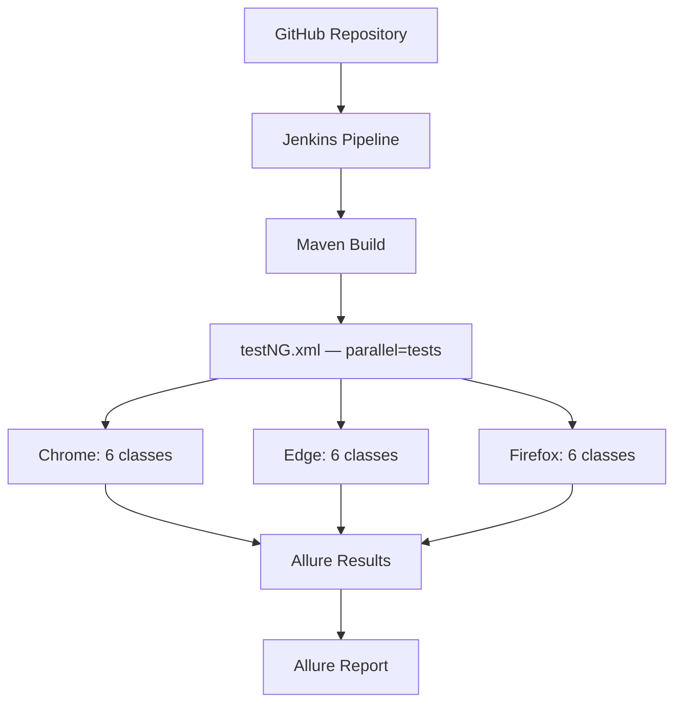

# 🚀 HamoFirstSelenium — Web Automation Testing Framework

<div align="center">

### Selenium-Based End-to-End Automation Framework

Automated testing framework for the **AwesomeQA E-Commerce Application**


</div>

---

# 📌 Project Overview

A comprehensive Selenium-based test automation framework for the **AwesomeQA** e-commerce web application.

🔹 Covers complete user journeys (login, registration, search, cart, wishlist, contact form)

🔹 Uses Page Object Model (POM)

🔹 Supports Data-Driven Testing

🔹 Includes BDD with Cucumber

🔹 Runs the **full regression suite in parallel across Chrome, Edge, and Firefox** — headless, on every browser at once

🔹 CI/CD enabled via Jenkins, triggered every 12 hours

🔹 Rich reporting with Allure

### 🔗 Application Under Test

[https://awesomeqa.com/ui](https://awesomeqa.com/ui)

---

# 🛠 Tech Stack

| Tool               | Version | Purpose                                  |
| ------------------- | ------- | ----------------------------------------- |
| Java                | 21      | Primary language                         |
| Selenium WebDriver  | 4.46.0  | Browser automation                       |
| TestNG              | 7.10.2  | Test framework, parallel execution       |
| Cucumber (BDD)      | 7.20.1  | Behavior-driven scenarios                |
| Jackson             | 2.18.3  | JSON test data parsing                   |
| Allure              | 2.24.0  | Test reporting                           |
| AspectJ             | 1.9.20.1| Allure step-level instrumentation        |
| Maven               | 3.x     | Build & dependency management            |
| Jenkins             | Latest  | CI/CD pipeline, scheduled every 12h      |

> `webdrivermanager` is still declared in `pom.xml` but is **not used** anywhere in the code — Selenium 4.6+ resolves and caches the correct browser driver automatically via its built-in Selenium Manager, so no manual driver management is needed.

---

# 📂 Project Structure

```text
HamoFirstSelenium/
├── src/
│   ├── main/java/org/Pages/
│   │   ├── LoginPage.java
│   │   ├── RegisterPage.java
│   │   ├── AddToCart.java
│   │   ├── WishlistFeature.java
│   │   ├── SearchFeature.java
│   │   └── ContactUsFeature.java
│   │
│   └── test/java/
│       ├── factory/
│       │   ├── BrowserOptionsFactory.java   # Chrome / Edge / Firefox options
│       │   └── DriverFactory.java           # ThreadLocal<WebDriver>, init/get/quit, retry
│       │
│       ├── testsPackage/
│       │   ├── BaseTest.java                # shared @BeforeMethod / @AfterMethod
│       │   ├── LoginTest.java
│       │   ├── RegisterTest.java
│       │   ├── AddtoCartTest.java
│       │   ├── AddtoWishlistTest.java
│       │   ├── SearchFeatureTest.java
│       │   └── ContactUsTest.java
│       │
│       ├── data/
│       │   ├── LoginData.java
│       │   ├── RegisterData.java
│       │   ├── SearchData.java
│       │   └── ContactUsData.java
│       │
│       ├── runners/
│       │   └── LoginCucumberTest.java
│       │
│       ├── stepDefinitions/
│       │   └── LoginSteps.java
│       │
│       └── utils/
│           └── JsonUtils.java
│
├── src/test/resources/
│   ├── features/
│   │   └── login.feature
│   │
│   └── testDatafiles/
│       ├── loginData.json
│       ├── registerData.json
│       ├── SearchData.json
│       └── ContactUs.json
│
├── testNG.xml
├── testNG-cucumber.xml
├── pom.xml
└── README.md
```

---

# 🎯 Test Coverage

Every one of the 6 features has **two independent implementations** — a TestNG + Page Object test and a separate Cucumber + Gherkin scenario:

| Feature           | TestNG + Allure       | Cucumber + Gherkin       |
| ------------------ | ----------------------- | -------------------------- |
| Login              | `LoginTest`             | `LoginCucumberTest`        |
| Registration       | `RegisterTest`          | `RegisterCucumberTest`     |
| Add to Cart        | `AddtoCartTest`         | `AddToCartCucumberTest`    |
| Add to Wishlist    | `AddtoWishlistTest`     | `WishlistCucumberTest`     |
| Search             | `SearchFeatureTest`     | `SearchCucumberTest`       |
| Contact Us         | `ContactUsTest`         | `ContactUsCucumberTest`    |

The TestNG suite (`testNG.xml`) is the one that runs in parallel across **all three browsers**, every run. The Cucumber suite (`testNG-cucumber.xml`) currently runs separately, on Chrome only.

---

# 🏗 Design Patterns & Architecture

## 📘 Page Object Model (POM)

Every page in the application has a dedicated class under `src/main/java/org/Pages/`, encapsulating locators, user actions, and page-level assertions — test logic stays separate from UI details, so a locator change only touches one file.

## 📘 Data-Driven Testing

Test data lives externally in JSON under `src/test/resources/testDatafiles/`, read at runtime by `JsonUtils` (Jackson) — data changes don't require touching source code.

## 📘 Driver Management: Factory Pattern + ThreadLocal

Driver setup used to be duplicated inside every test class's own `@BeforeMethod`. It's now centralized in three classes:

**`BrowserOptionsFactory`** — builds the right `Options` object per browser:

```java
public static ChromeOptions getChromeOptions() { ... }
public static EdgeOptions getEdgeOptions() { ... }
public static FirefoxOptions getFirefoxOptions() { ... }
```

**`DriverFactory`** — owns a `ThreadLocal<WebDriver>` so each parallel browser thread gets its own isolated driver instance, with a short retry for transient `SessionNotCreatedException` failures under parallel load:

```java
private static final ThreadLocal<WebDriver> driver = new ThreadLocal<>();

public static void init(String browser) { ... }  // retries once on SessionNotCreatedException
public static WebDriver get() { return driver.get(); }
public static void quit() { ... }                // quits and clears the ThreadLocal
```

**`BaseTest`** — reads the `browser` parameter from `testNG.xml` and hands it to `DriverFactory`:

```java
@Parameters("browser")
@BeforeMethod
public void setUp(@Optional("chrome") String browser) {
    DriverFactory.init(browser);
    driver = DriverFactory.get();
}

@AfterMethod
public void tearDown() {
    DriverFactory.quit();
}
```

All 6 test classes now just `extends BaseTest` — no duplicated setup/teardown anywhere. The `@Optional("chrome")` default also means any single test class can still be run on its own from the IDE (outside `testNG.xml`) without needing a browser parameter.

## 📘 Cross-Browser & Parallel Execution

`testNG.xml` runs Chrome, Edge, and Firefox **at the same time**, each executing the **complete** 6-class suite — tests are never split between browsers:

```xml
<suite name="Regression Suite" parallel="tests" thread-count="3">
    <test name="Regression Test in Chrome">
        <parameter name="browser" value="chrome" />
        ...
    </test>
    <test name="Regression Test in Edge">
        <parameter name="browser" value="edge" />
        ...
    </test>
    <test name="Regression Test in Firefox">
        <parameter name="browser" value="firefox" />
        ...
    </test>
</suite>
```

Each `<test>` block runs the classes in a **different order** per browser (a staggered rotation), so no class occupies the same execution slot across two browsers at once. This reduces — though doesn't fully eliminate — the odds of `RegisterTest` racing itself across browsers if two browsers happen to hit registration at the exact same instant.

## 📘 Headless Execution

Chrome and Edge run with `--headless=new` and a fixed `--window-size=1920,1080`; Firefox runs with `-headless`. Each Chrome/Edge session also gets a unique `--user-data-dir` (via `Files.createTempDirectory`) to prevent profile-lock conflicts between the three simultaneous sessions.

## 📘 JavaScript Click for Dynamic Elements

Elements covered by dynamic overlays (sliders, banners) are clicked via `JavascriptExecutor` to bypass click-interception issues:

```java
JavascriptExecutor js = (JavascriptExecutor) driver;
js.executeScript("arguments[0].click();", element);
```

---

# ⚙ Jenkins Integration

## 🔄 How It Works



## 📋 Jenkins Pipeline Configuration

| Setting       | Value                                                |
| -------------- | ----------------------------------------------------- |
| Source         | GitHub — `mohamed17803/HamoFirstSelenium`            |
| Build Command  | `mvn clean test -Dsurefire.suiteXmlFiles=testNG.xml` |
| Trigger        | Every 12 hours (`H */12 * * *`)                      |
| Service Account| Regular Windows user (not Local System — see above)  |
| Report         | Allure plugin — reads `target/allure-results`        |

# 🚀 Setup & Execution

## Prerequisites

* Java 21+
* Maven 3.6+
* Chrome, Edge, and Firefox installed locally (for local parallel runs)

## Run Locally

```bash
# Clone repository
git clone https://github.com/mohamed17803/HamoFirstSelenium.git

# Enter project
cd HamoFirstSelenium

# Run the full parallel cross-browser regression suite
mvn clean test -Dsurefire.suiteXmlFiles=testNG.xml

# Generate and open the Allure report
allure serve target/allure-results
```

Any individual test class can also be run on its own from the IDE — it defaults to Chrome via `@Optional("chrome")` in `BaseTest`.

---

# 📊 Allure Reporting

Tests use Allure annotations for rich reporting:

```java
@Epic("User Authentication")
@Story("Login with valid credentials")
@Severity(SeverityLevel.BLOCKER)
@Description("Validate successful login redirects to account dashboard")
@Step("Submit login form with valid email and password")
```

### Reports Include

✅ Test Steps

✅ Severity Levels

✅ Pass/Fail History

✅ Execution Timeline per browser

---

# 👨‍💻 Author

**Mohamed Sayed**
Software Test Engineer

🐙 GitHub: `mohamed17803`

📧 Email: `mohameddsayedd17@gmail.com`
